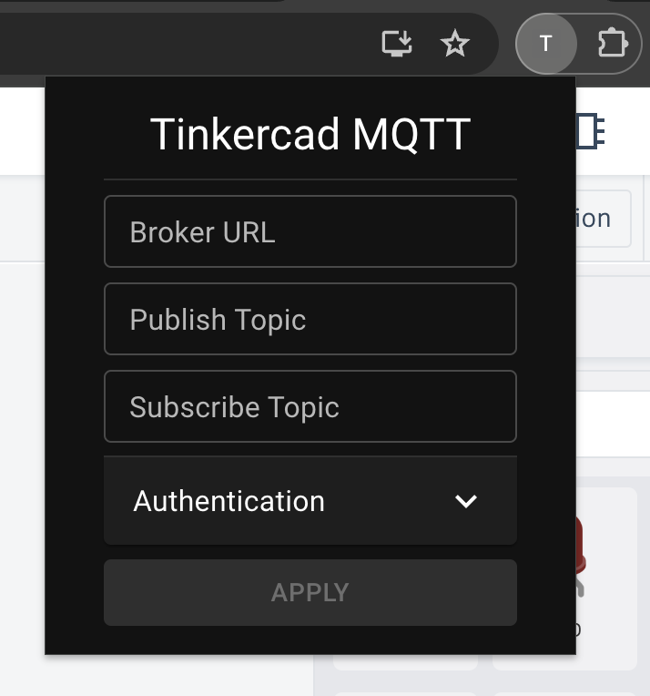
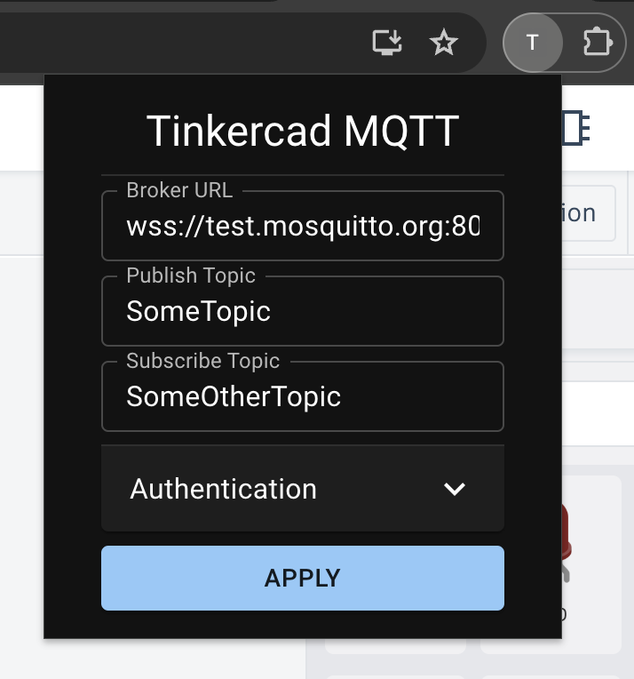
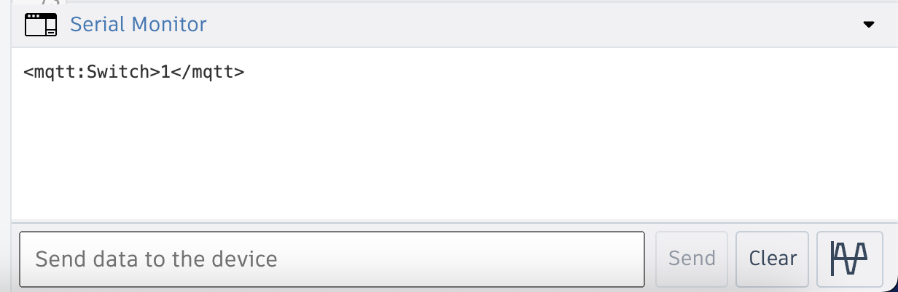
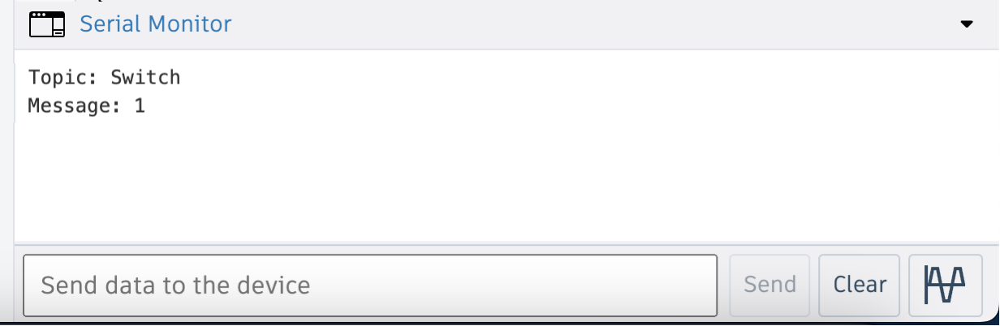

<!-- Improved compatibility of back to top link: See: https://github.com/othneildrew/Best-README-Template/pull/73 -->

<a name="readme-top"></a>

<!--
*** Thanks for checking out the Best-README-Template. If you have a suggestion
*** that would make this better, please fork the repo and create a pull request
*** or simply open an issue with the tag "enhancement".
*** Don't forget to give the project a star!
*** Thanks again! Now go create something AMAZING! :D
-->

<!-- PROJECT SHIELDS -->
<!--
*** I'm using markdown "reference style" links for readability.
*** Reference links are enclosed in brackets [ ] instead of parentheses ( ).
*** See the bottom of this document for the declaration of the reference variables
*** for contributors-url, forks-url, etc. This is an optional, concise syntax you may use.
*** https://www.markdownguide.org/basic-syntax/#reference-style-links
-->

[![Contributors][contributors-shield]][contributors-url]
[![Forks][forks-shield]][forks-url]
[![Stargazers][stars-shield]][stars-url]
[![Issues][issues-shield]][issues-url]
[![MIT License][license-shield]][license-url]

<!-- PROJECT LOGO -->
<br />
<div align="center">
  <a href="https://github.com/othneildrew/Best-README-Template">
    
  </a>

<h3 align="center">Tinkercad MQTT</h3>

  <p align="center">
    A Web extension to connect multiple Tinkercad simulations via MQTT
    <br />
    <a href="https://github.com/simon-lw/tinkercad-mqtt"><strong>How to install & use »</strong></a>
    <br />
    <br />
    <a href="https://github.com/simon-lw/tinkercad-mqtt/issues/new?labels=bug&template=bug_report.md&title=%5Bbug%5D">Report Bug</a>
    ·
    <a href="https://github.com/simon-lw/tinkercad-mqtt/issues/new?labels=enhancement&template=feature_request.md&title=%5Bfeat%5D">Request Feature</a>
  </p>
</div>

<!-- ABOUT THE PROJECT -->

## About The Project

Tinkercad MQTT is a project that allows you to connect the serial monitor of the Tinkercad simulator to an MQTT broker.
This allows you to send data from Tinkercad to an MQTT broker and vice versa.

<p align="right">(<a href="#readme-top">back to top</a>)</p>

### Built With

[![React][React.js]][React-url]
[![Vite][Vite]][Vite-url]
[![NPM][NPM]][npm-url]
[![TypeScript][TypeScript]][TypeScript-url]

<p align="right">(<a href="#readme-top">back to top</a>)</p>

<!-- GETTING STARTED -->

## Getting Started

If you simply want to use the extension, we recommend that you proceed with the installation using the release. If you want to build the extension yourself, proceed with the installation using the source.

### Install using release

Download and unpack the official [Release][Release-url]. Then proceed as follows for the browser that you want to use it in.

#### Chrome

Go to the [Extensions page][Extension-manager-url]. In the top left corner, select `Load unpacked`. Locate the unpacked release and select the `Chrome` directory.

#### Firefox

### Install using source

1. Clone the repo
   ```sh
   git clone https://github.com/simon-lw/tinkercad-mqtt.git
   ```
2. Install NPM packages
   ```sh
   npm install
   ```
3. Either build the extension for both browsers using
   ```sh
   npm run build
   ```
   Or use one of the following commands to build the extension only for Chrome or Firefox.
   ```sh
   npm run build:chrome
   ```
   ```sh
   npm run build:firefox
   ```

<p align="right">(<a href="#readme-top">back to top</a>)</p>

<!-- USAGE EXAMPLES -->

## Usage

### Connect to Broker

In order to connect to a broker, go to your Tinkercad simulation and start the extension. A pop-up window will appear

<div align="center"> 
 
</div>

In this window enter the broker url.
The other options include the topic that can be subscribed and the topic that the extension can publish to.

If the broker requires authentication, the username and password can be entered into the corresponding fields after opening the authentication drop-down menu.

In order to disconnect from the broker, leave the `broker-url` field empty.

**The broker options will be saved in the local storage and the connection will be applied as soon as the simulation starts. The status of the connection will be displayed on the bottom left corner of the browser.**

#### Protocols

Use the secure websocket protocol `wss` to connect to a remote broker. If the connection is not secure, the browser will block the traffic.

If you run a broker locally, you can also use the unsecure websocket
protocol `ws`.

### Send Data

After entering the connection options into the pop-up window of the extension as described above,
use the following code in the simulation to send data via MQTT.

```c++
void sendMqttMessage(String topic, int message)
{
    Serial.print("<mqtt:");
    Serial.print(topic);
    Serial.print(">");
    Serial.print(message);
    Serial.print("<");
    Serial.println("/mqtt>");
}
```

The topic variable in the code serves as sub-topic for the receiving end and does not need to have the same value as the topic entered in the pop-up window.
The extension will send the printed message to the topic entered in the pop-up window.

### Receive Data

After entering the connection options into the pop-up window of the extension as described above,
use the following code in the simulation to receive data via MQTT.

Declare the `processMqttMessage()` function

```c++
void processMqttMessage(void (*callback)(String, String))
{
    if (Serial.find("<mqtt:"))
    {
        String topic = Serial.readStringUntil('>');
        String message = Serial.readStringUntil('<');

        if (Serial.find("/mqtt>"))
        {
            callback(topic, message);
        }
    }
}
```

And call it when needed, i.e. in the `loop()` method of your Arduino

```c++
processMqttMessage([](String topic, String message) {
    Serial.print("Topic: ");
    Serial.println(topic);
    Serial.print("Message: ");
    Serial.println(message);
    Serial.println("");
  });
```

The topic variable in the code serves as sub-topic and does not need to be the same as entered in the pop-up window.

### Example

Using the following connection options on a sending simulation

<div align="center">
 
</div>

and the `sendMqttMessage()` as declared above in the documentation, we can send the status of a switch, that we declared in the code, like this

```c++
sendMqttMessage("Switch", currentSwitchState);
```

This will print the following

<div align="center">
 
</div>
And trigger the extension to send the printed message to the topic `SomeTopic` .

On the receiving end, if the topic `SomeTopic` is subscribed in the pop-up window, using the previously declared `processMqttMessage()` we will receive

<div align="center">
 
</div>

<p align="right">(<a href="#readme-top">back to top</a>)</p>

## ⚠️ Security ⚠️

Currently, the options of the connection to the MQTT broker are stored in the local storage of the browser. This includes username and password for authentication. We recommend to connect to a broker that does not require authentication.

<!-- LICENSE -->

## License

Distributed under the MIT License. See `LICENSE.txt` for more information.

<p align="right">(<a href="#readme-top">back to top</a>)</p>

<!-- MARKDOWN LINKS & IMAGES -->
<!-- https://www.markdownguide.org/basic-syntax/#reference-style-links -->

[contributors-shield]: https://img.shields.io/github/contributors/simon-lw/tinkercad-mqtt.svg?style=for-the-badge
[contributors-url]: https://github.com/simon-lw/tinkercad-mqtt/graphs/contributors
[forks-shield]: https://img.shields.io/github/forks/simon-lw/tinkercad-mqtt.svg?style=for-the-badge
[forks-url]: https://github.com/simon-lw/tinkercad-mqtt/network/members
[stars-shield]: https://img.shields.io/github/stars/simon-lw/tinkercad-mqtt.svg?style=for-the-badge
[stars-url]: https://github.com/simon-lw/tinkercad-mqtt/stargazers
[issues-shield]: https://img.shields.io/github/issues/simon-lw/tinkercad-mqtt.svg?style=for-the-badge
[issues-url]: https://github.com/simon-lw/tinkercad-mqtt/issues
[license-shield]: https://img.shields.io/github/license/simon-lw/tinkercad-mqtt.svg?style=for-the-badge
[license-url]: https://github.com/simon-lw/tinkercad-mqtt/blob/main/LICENSE.txt
[product-screenshot]: images/screenshot.png
[Next.js]: https://img.shields.io/badge/next.js-000000?style=for-the-badge&logo=nextdotjs&logoColor=white
[Next-url]: https://nextjs.org/
[React.js]: https://img.shields.io/badge/React-20232A?style=for-the-badge&logo=react&logoColor=61DAFB
[React-url]: https://reactjs.org/
[Vite]: https://img.shields.io/badge/vite-%23646CFF.svg?style=for-the-badge&logo=vite&logoColor=white
[Vite-url]: https://vitejs.dev/
[NPM]: https://img.shields.io/badge/npm-CB3837?style=for-the-badge&logo=npm&logoColor=white
[npm-url]: https://www.npmjs.com/
[TypeScript]: https://img.shields.io/badge/TypeScript-007ACC?style=for-the-badge&logo=typescript&logoColor=white
[TypeScript-url]: https://www.typescriptlang.org/
[Release-url]: https://github.com/simon-lw/tinkercad-mqtt/releases/download/v0.1.0/v0.1.0.zip
[Extension-manager-url]: chrome://extensions/

[//]: <>
